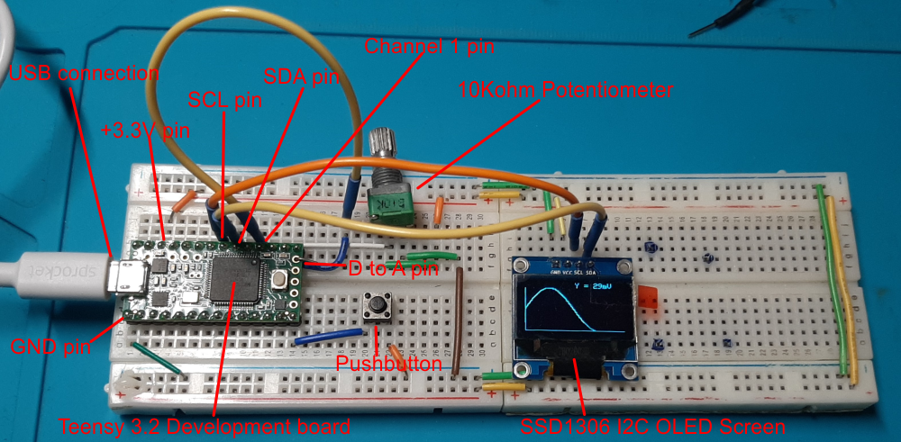
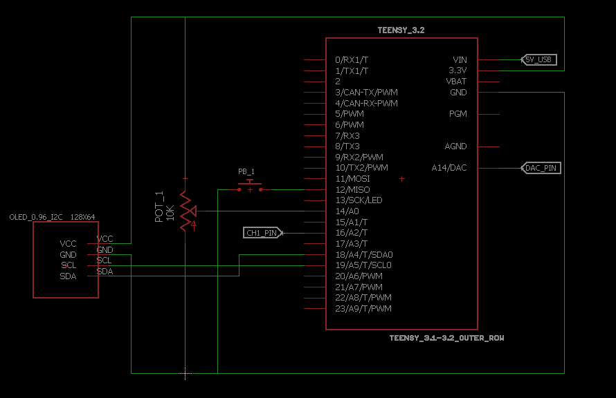
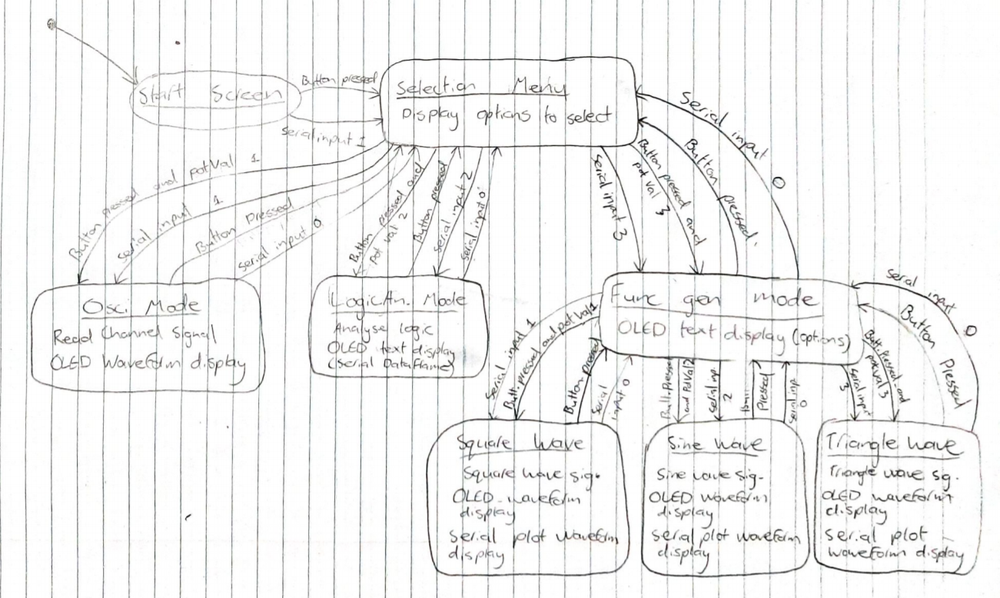
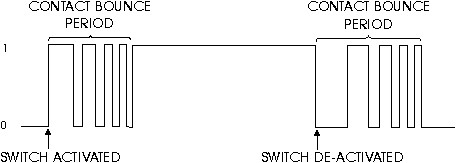
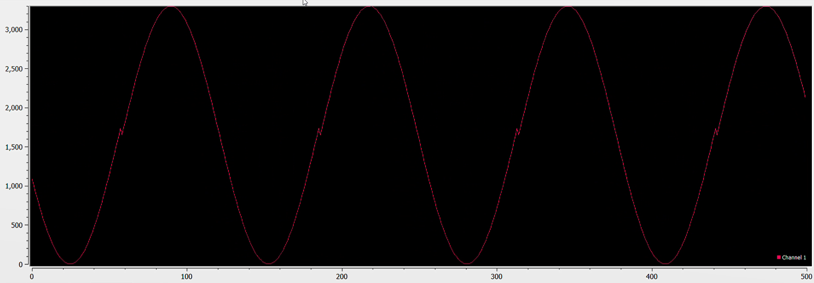

# Assignment 1: “Logic Analyzer + Minimal Oscilloscope + Signal Generator" Report

Embed assignment coversheet here

## 1. Abstract

## 2. Introduction

The aim of this project was to design and construct a prototype of a system with the functionality of a minimal oscilloscope, signal generator with square wave, triangle wave and sine wave output capability, and a logic analyser.

The requirements of the project are as follows:

1. One channel oscilloscope (0V - 3.3V) using the uC ADC peripheral
2. One channel function generator using the uC DAC with the option to select between at least a square, triangle and sin signal)
3. One channel logic analyzer, that allows for decoding of a 9600 baud serial frame
4. When acting in one of the above-mentioned modes, the relevant signals should be streamed out in “real-time” via UART(-> USB) to a connected PC and visualized using a serial plotter and in parallel displayed on the provided OLED display.
5. It should be possible to control the different functions(modes) via connected push-buttons and in parallel via commands send from the PC to the uC via USB(->UART)
6. The system should be structured and implemented as a finite state machine

The protype was designed and constructed on a breadboard using the following components:

1. Teensy 3.2 Microcontroller development board
2. SDD1306 I2C controlled OLED Display
3. 10kOhm potentiometer
4. Pushbutton
5. Various jumper wires

The program was intially created in several smaller programs, each with dedicated functions, then they were integrated in a main program.

## 3. Methods

### 3.1 Prototype Overview

Most of the prototype was pre-assembled from a previous assignment's prototype. A second breadboard was added to include the OLED screen. It was bread-boarded according to the schematic in figure 2 and the overall prototype can be seen in figure 1.

#### Overview Image

The annotated overview image is seen in figure 1 below.

*Figure 1: Annotated Prototype Overview*

#### Schematic

The circuit schematic in figure 2 was created using Autodesk Eagle. The files for which can be found [here](Project_Media/Eagle_files).

*Figure 2: Circuit schematic*

### Operation

This system can be operated simultaneously using PC USB to UART character inputs or the system's pushbutton and potentiometer as a cursor control. The user is greeted with a start screen, where they can press the button or send a serial command to start. The next screen is a selection menu where the user can choose either the minimal oscilloscope, function generator or logic analyser. The logic analyser was not completed due to time constraints. The minimal oscilloscope mode takes an analogue to digital reading on the 'ch1' pin and plots the waveform to the serial plotter on PC and on the OLED screen with the current voltage reading displayed in millivolts. The user can either send a number character to the microcontoller or scroll though the options and press the button for the mode they choose. The button or a serial command of '0' will exit the chosen mode back to the previous screen. The function generator screen gives the user another set of options of either square, triangular or sine wave generators. The generated waves are outputted to a digital to analogue converter pin.

### 3.2 Finite State Machine Design

A Moore Finite state machine was used for the program as the system can be sectioned into varous descrete modes, with its output actions only determined by its current state.

#### States

Firstly, the states were defined as follows:

* **Start Screen**: The user can be greeted by a start screen where they can choose start when they are ready.
* **Selection Menu**: Provide a menu on the OLED screen to choose which mode the user wants.
* **Osci. Mode**: Minimal oscilloscope mode, where a voltage signal can be read and visualised on a PC with a serial plotter and on the prototype through the SDD1306 OLED screen in real time.
* **Func.Gen. Mode**: Function generator mode, where the user can choose which function they want.
* **Logic An. Mode**: Logic analyser mode, where a 9600 baud dataframe can be read and interpreted.
* **Square wave**: Produce a square wave using the Teensy3.2's digital to analogue converter.
* **Sine wave**: Produce a sine wave using the Teensy3.2's digital to analogue converter.
* **Triangle Wave**: Produce a Triangle wave using the Teensy3.2's digital to analogue converter.

#### Events

Utilising the pushbutton, 10Kohn potentiometer, and USB to UART serial interface, the following event conditions could be defined:

* Button_Pressed
* Button_Pressed_and_potVal0
* Button_Pressed_and_potVal1
* Button_Pressed_and_potVal2
* Button_Pressed_and_potVal3
* Serial_input_1
* Serial_input_2
* Serial_input_3

#### Actions

The actions are likely to be complex, so the following actions can be taken as general concepts for functions:

* Square wave signal
* Sine wave signal
* Triangle wave signal
* Read channel signal
* Analyse logic
* OLED waveform display
* OLED text display
* Serial plot waveform display

#### State Transition Diagram

The state transition diagram can be seen in figure 3 below. Full PDF version can be found [here](Project_Media/STD_diagram.pdf). This diagram utilizes all states, events, and actions outlined previously. The diagram is busier than it needs to be as each transition is shown as serparate event arrows. This could have been simplified by combining each event with "or" statements.

*Figure 3: State Transition Diagram*

#### 3.2.1 Finite State Machine Implementation

The implementation before any actions were added can be seen below.

#### Setups

    //***Finite State Machine Setups***
    //Events
    volatile bool buttonPressed = false;
    bool BP_pot0 = false; //Button pressed and pot value 0
    bool BP_pot1 = false; //Button pressed and pot value 1
    bool BP_pot2 = false;
    bool BP_pot3 = false;
    bool serialIn0 = false; //Serial input 0
    bool serialIn1 = false; //Serial input 1
    bool serialIn2 = false;
    bool serialIn3 = false;

    //States
    enum states {
    StartScreen, 
    SelectionMenu,
    OsciMode, 
    FuncGenMode, 
    LogicAnalyserMode, 
    SquareWave, 
    SinWave, 
    TriangleWave,
    };

    states currentState = StartScreen;

The "enum" variable type is useful for defining the states as it can enumerate a comma-separated list. Each enumerator in the list can be called as its name, but it is represented as a number for the compiler. This helps with readability.

#### Main code

    //============= Finite State Machine =============
    switch (currentState) {
        case StartScreen:
            Serial.println("Screen");
            checkConditions();
            if(buttonPressed || serialIn1){
            currentState = SelectionMenu; 
            buttonPressed = false;
            }
            break;

        case SelectionMenu:
            Serial.println("Menu");
            checkConditions();
            if(buttonPressed || serialIn0){
            currentState = StartScreen; //Go back
            buttonPressed = false;
            } 
            if(BP_pot1 || serialIn1){currentState = OsciMode;}
            if(BP_pot2 || serialIn2){currentState = LogicAnalyserMode;}
            if(BP_pot3 || serialIn3){currentState = FuncGenMode;}
            break;

        case OsciMode:
            Serial.println("OsciMode");
            checkConditions();
            if(buttonPressed || serialIn0){
            currentState = SelectionMenu;  //Go back
            buttonPressed = false;
            }
            break;

        case FuncGenMode:
            Serial.println("FuncGenMode");
            checkConditions();
            if(buttonPressed || serialIn0){
            currentState = SelectionMenu; //Go back
            buttonPressed = false;
            } 
            if(BP_pot1 || serialIn1){currentState = SquareWave;}
            if(BP_pot2 || serialIn2){currentState = SinWave;}
            if(BP_pot3){currentState = TriangleWave;}
            break;

        case LogicAnalyserMode:
            Serial.println("LogicAnalyserMode");
            checkConditions();
            if(buttonPressed || serialIn0){
            currentState = FuncGenMode;  //Go back
            buttonPressed = false;
            }
            break;

        case SquareWave:
            Serial.println("SquareWave");
            checkConditions();
            if(buttonPressed || serialIn0){
            currentState = FuncGenMode;  //Go back
            buttonPressed = false;
            }
            break;

        case SinWave:
            Serial.println("SinWave");
            checkConditions();
            if(buttonPressed || serialIn0){
            currentState = FuncGenMode;  //Go back
            buttonPressed = false;
            }
            break;

        case TriangleWave:
            Serial.println("TriangleWave");
            checkConditions();
            if(buttonPressed || serialIn0){
            currentState = FuncGenMode;  //Go back
            buttonPressed = false;
            }
            break;

        default:
            //ignore
            break;
        }

Each state includes a "checkConditions()" function for polling all the events.

#### Events Implementation

The events were checked using the code for the following function:

    //***Function to check event conditions***
        void checkConditions(){
        //Pot value selection
        potSelectVal = map(analogRead(potPin),0,1023,0,3);//Pot value from 0-3
        
        /*
        //Debugging
        Serial.print(potSelectVal);
        Serial.print(",");
        Serial.print(buttonPressed);
        */
        
        //Serial inputs
        uint8_t incomingBit = Serial.read();
        
        if(buttonPressed == true && (potSelectVal ==0)){
            BP_pot0 = true; //Button pressed, potVal0
            //buttonPressed = false;
        } 
        else{BP_pot0 = false;}

        if(buttonPressed == true && (potSelectVal ==1)){
            BP_pot1 = true; //Button pressed, potVal1
            //buttonPressed = false;
        } 
        else{BP_pot1 = false;}

        if(buttonPressed == true && (potSelectVal ==2)){
            BP_pot2 = true; //Button pressed, potVal2
            //buttonPressed = false;
        } 
        else{BP_pot2 = false;}

        if(buttonPressed == true && (potSelectVal ==3)){
            BP_pot3 = true; //Button pressed, potVal3
            //buttonPressed = false;
        } 
        else{BP_pot3 = false;}

        if(incomingBit == '0'){serialIn0 = true;}
        else{serialIn0 = false;}

        if(incomingBit == '1'){serialIn1 = true;}
        else{serialIn1 = false;}

        if(incomingBit == '2'){serialIn2 = true;}
        else{serialIn2 = false;}

        if(incomingBit == '3'){serialIn3 = true;}
        else{serialIn3 = false;}
        }

    //***Function to reset signal***
        void resetSignal(){
        currYSigVal = 0; //Reset signal before moving
        currXDrawVal = 0; 
        analogWrite(DAPin, 0);

        YSigVal = 0;
        XSigVal = 0;
        XSinVal = 0;
        }

It uses 'if' and 'else' statements to determine which events are active (true) or nonactive (false).

### 3.3 OLED Screen

#### 3.3.1 I2C Protocol

I2C, or Inter-integrated circuit, is a synchronous, half-duplex communication protocol. This means that it includes a dedicate clock wire to synchronise the communication between devices, and a single data signal wire which can carry information in both directions, one direction at a time. Each device on using the I2c protocol needs an adress so that the master controller can select which device it wants to send or receive information from. A simplified diagram can be seen in figure 4 below. Pullup resistors are often added to discharge the capacitance induced charge between the two wires.

*Figure 4: Simplified I2C protocol diagram  (Circuit Basics, n.d.)*

#### 3.3.2 Libraries

The SSD1306 required libraries to be utilised. The Adafruit_SSD1306 and Adafruit_GFX libraries were used for this.

#### 3.3.3 Finding OLED Screen's I2C Device Adress

An arduino example program was used to find the screens I2C device address. The program scans through standard 7-bit I2C adresses and outputs the device's address to the serial monitor if it finds it. It found that the SSD1306 OLED screen's device adress is "0x3C".

#### 3.3.4 Testing the OLED Screen

The OLED screen was tested using an example program from the Adafruit_SSD1306 library. The program scrolled through all its different drawing functions.

The first screen used had an issue with its reolution. The majority of the top of the screen appeared to have a reduced resolution. A new screen was given which worked properly.

### 3.4 Pushbutton

The pushbutton was configured by assigning it to pin 12, intialising it with the pin's internal pullup resistor, then it's pin had an external interupt attached to it. The setups from the main code can be seen below. The internal pullup resistor was used for simplicity of the prototype.

    //At the top of program, before setup function:
    #define buttonPin 12

    //In setup function
    pinMode(buttonPin, INPUT_PULLUP);
    attachInterrupt(buttonPin, ISR_Button, FALLING);

#### 3.4.1 External Interrupt

The external interrupt was used so that the button press would be detected almost instantly rather than polling for it. This meant that the project was much less likely to miss the button press. Since the edge detection could be defined by interupt setup, the button press could easily be detected i.e. triggering only when the button activated (high to low using internal pullup). The interrupt service routine (ISR) used in this program can be seen below:

    void ISR_Button(){
        static uint32_t previousMillisButton = 0;
        uint32_t currentMillisButton = millis();
            if ((currentMillisButton - previousMillisButton) >= debounceTime_ms){
            previousMillisButton = currentMillisButton;
            buttonPressed = true;
            }
        }

When the interupt is triggered, the ISR is executed.

#### 3.4.2 Debouncing the Button

Due to the mechanical structure of the pushbutton, the signal oscillates when it is pressed and released. This is called 'bouncing' and is illustrated by figure 5 below. This was overcome in software (seen in the ISR code above) whereby the a delay was setup using the real time timer function 'millis()' and an 'if' statement. A debounce time global variable is configured at the top of the program, which is the 'delay' value. This delay is used to make sure the bouncing has finished, so that the 'if' statement is only executed once per button press. The 'buttonPressed' variable was declared as a volatile bool type, and was always set true when the button is pressed. The main program could then poll for this variable and set it to false when it has been used.

*Figure 5: Signal produced by pushbutton (Electronix Express, n.d.)*

### 3.5 Potentiometer

The potentiometer was defined by a analogue to digital (A/D) type pin; 14, with an analogueRead resolution of 10 bits for a 0-1023 signal range. The potentiometer was used for the menu option selection cursor value by mapping its range of 0-1023 to a range of 0-3. The implementation was seen in the code in the '[Events Implementation](#events-implementation)' subsection of '[3.2.1 Finite State Machine Implementation](#321-finite-state-machine-implementation)'.

### 3.6 Program Overview

#### 3.6.1 Minimal Oscilloscope

A function was created for a simple oscilloscope which took a reading from the "Ch1" analogue to digital converter (ADC) pin, displayed it on a set of axes on the screen, and printed the current voltage reading in millivolts on the screen. This function was used in FSM states; OsciMode, FuncGenMode, SquareWave, SinWave, and TriangleWave. This was first created as a stand-alone "sub-project" found [here](Sub_Projects/SimpleOscilloscope2) before being placed in a function.

The main code for the function can be seen below:

    //X Draw Values
    uint32_t prevXDrawVal = currXDrawVal-1;
    if(currXDrawVal >= 0 && currXDrawVal <= plotWidth){currXDrawVal++;} //Configure counter
    else{currXDrawVal = prevXDrawVal = 0; display.clearDisplay();}
    

    //Channel 1 A/D reading and mV mapping
    uint32_t potVal = analogRead(ch1Pin); 
    uint32_t volts_mV = map(potVal,0,1023,0,maxVoltage_mV);

    //Y Draw Values
    static uint32_t prevYDrawVal = 0;
    static uint32_t currYDrawVal = 0;
    prevYDrawVal = currYDrawVal; //y value from previous cycle
    currYDrawVal = plotHeight - map(analogRead(ch1Pin),0, 1023, 0, plotHeight);
    currYDrawVal = currYDrawVal + plotHeightOffset;

    //===================== OLED Screen Plotting =====================
    //Draw X Axis
    display.drawLine(0,SCREEN_HEIGHT-1,SCREEN_WIDTH-1,SCREEN_HEIGHT-1, WHITE);
    //Draw Y Axis
    display.drawLine(0, plotHeightOffset, 0, SCREEN_HEIGHT-1, WHITE);
    
    //Display Value
    static int16_t displayValXPos = (SCREEN_WIDTH-1)/2 + 2;  //Start at 1/3 of screen
    display.fillRect(displayValXPos, 0, displayValXPos -2, plotHeightOffset, BLACK);
    display.setTextSize(1); display.setTextColor(WHITE); // Draw white text, size 1
    display.setCursor(displayValXPos, 0);                // Start at top middle
    display.print(("Y = "));
    display.print((volts_mV));
    display.println(("mV"));

    //Plot Values
    display.drawLine(prevXDrawVal, prevYDrawVal, currXDrawVal, currYDrawVal, WHITE);
    Serial.println(volts_mV);
    
    //Update Screen
    display.display();  

This code works best for low-speed signals as it samples once per column for the screen. This way, it can only sample signals as fast as the screen can process which sub-optimal for speed.

#### 3.6.2 Function Generator

The function generator state in the program works as another menu screen. The options in this menu are square, triangle, and sine waves as mentioned previously.

##### Square Wave

This square wave generator is very limited in capability. The code for which can be found below. It was first developed as a stand-alone 'sub-project' which can be found [here](Sub_Projects/SquareWaveGen), and was then converted into a function to be called by the main program in the 'SquareWave' state. The X values are determined by a counter, which corresponds to the minimal oscilloscope plot code. The Y values are generated by simple 'if' statements. There is minimal customisability using this method as the signal is hard-coded in. However, the signal amplitude can be changed by the 'squareSigRange' global constant variable at the top of the main code. The signal is then produced by writing the current signal value to the digital to analogue converter. The simpleOscilloscope function is then called to read the voltage from 'ch1', assuming the D to A pin is connected to it.

    //Declare Timing Variables
        static uint32_t previousTime_us = 0; //Declares only once
        uint32_t currentTime_us = micros();

        if ((currentTime_us - previousTime_us) >= squareScanTime_us){
            //============= Generating Signal =============
            //X signal Values
                if(XSigVal >= 0 && XSigVal <= plotWidth){XSigVal++;} //Configure counter
                else{XSigVal = 0; display.clearDisplay();}
            
            //Y signal Values
            if(XSigVal >= 0 && XSigVal < plotWidth/4){
                YSigVal = 0;
            }
            if(XSigVal >= plotWidth/4 && XSigVal < plotWidth/2){
                YSigVal = squareSigRange;
            }
            if(XSigVal >= plotWidth/2 && XSigVal < 3*plotWidth/4){
                YSigVal = 0;
            }
            if(XSigVal >= 3*plotWidth/4 && XSigVal < plotWidth){
                YSigVal = squareSigRange;
            }

            //Output D/A signal
            analogWrite(DAPin, YSigVal);
            
            //Plot Values
            simpleOscilloscope();

            previousTime_us = currentTime_us; 
        }

##### Triangle Wave

The code for this function is very simple and can be found below. It was first developed as a stand-alone 'sub-project' which can be found [here](Sub_Projects/TriangleWaveGen2), and was then converted into a function to be called by the main program in the 'TriangleWave' state. The wave is created by simple count up/down statements with certain conditions. It will only start counting up when the count has reached 0, and will only start counting down when the count has reached the 'triangSigRange' value which is defined at the top of the main code as a global constant variable. The speed of the wave can be changed by altering the increment/decrement value. It would have been more efficient to have this value defined as a global constant. The signal is then produced and read by the same means as before.

    //Declare Timing Variables
        static uint32_t previousTime_us = 0; //Declares only once
        uint32_t currentTime_us = micros();

        if ((currentTime_us - previousTime_us) >= scanTime_us){
            //Local Variables
            static bool countUp = false;
            static bool countDown = false;

            //============= Generating Signal =============
            //Counting Conditions
            if(currYSigVal <= 0){
            countUp = true;
            countDown = false;
            }

            if(currYSigVal >= triangSigRange){
            countDown = true;
            countUp = false;
            }

            //Counting Up
            if(countUp){currYSigVal = currYSigVal + 50;}
            //Counting Down
            if(countDown){currYSigVal = currYSigVal - 50;}
            

            analogWrite(DAPin, currYSigVal);
            

            //Plot Values
            simpleOscilloscope();

        }
        }

##### Sine Wave

The code for the sine wave uses the 'sin()' function in C++. It was first developed as a stand-alone 'sub-project' which can be found [here](Sub_Projects/SineWaveGen), and was then converted into a function to be called by the main program in the 'SinWave' state. The X values are determined by a counter, which corresponds to the minimal oscilloscope plot code. The X value is then mapped to 2*Pi to get one full wave in the plot, then multiplied by 10,000 to avoid using floating point numbers. The 'YSigVal' was composed of the sin function, multiplied by the signal range divided by 2 for the amplitude, and the signal range divided by 2 was added to position the wave in the middle of the screen. The signal was then produced and read by the same means as before, however there was an issue with the serial output signal to the plotter (see figure 6 below). It worked fine on the OLED screen but the plotter showed a small jump whenever the screen was updated.

    //Sine Wave Mode
        void sinWave(){
        //Declare Timing Variables
        static uint32_t previousTime_us = 0; //Declares only once
        uint32_t currentTime_us = micros();

        if ((currentTime_us - previousTime_us) >= scanTime_us){
        //============= Generating Signal =============
            //X signal Values
            if(XSigVal >= 0 && XSigVal <= plotWidth){XSigVal++;} //Configure counter
            else{XSigVal = 0; display.clearDisplay();}
            //Y signal Values
            YSigVal = 0; //Current signal value
            XSinVal = map(XSigVal,0,plotWidth,0,62831); //Map plot width to 2*Pi*10000
            YSigVal = sin((double)XSinVal/10000) * sinSigRange/2 + sinSigRange/2;

        //Output D/A signal
            analogWrite(DAPin, YSigVal);

        //Plot Values
            simpleOscilloscope();

        }
    }

*Figure 6: Sine Wave Signal Plot Issue*

#### 3.6.3 Logic Analyser

This function wasn't added to the program due to time constraints, but this section will detail how it would have been attempted. A serial communication line would have been produced by an alternate set of serial TX/RX pins such as 9 and 10 (Serial2 Rx and Tx respectively) on the teensy 3.2 development board with a baudrate of 9600. A digital I/O pin would have been setup with two external interrupt functions (falling edge and rising edge) and connected to the serial2 Tx pin. An array would be setup for a 10bit dataframe. The array would have a size of 10, where an indexer variable would be used for integers 0 to 9. The indexer would be declared as a volatile global variable. Whenever either the falling or rising edge interrupt service routine is called, it would increment the indexer by 1, and a 1 would be written to the corresponding array slot on a rising edge trigger, and a 0 for a falling edge trigger. When the indexer reaches 9, a 'for' loop in the main code would be used to write the array values, 1 to 8 to an 8bit 'characterRead' variable using the arduino bitWrite() function to compile each bit into a single byte, then clear the array. The main code would then write the 'characterRead' variable into a 'ASCIchar' char-type variable. This would then be printed on the OLED screen using 'display.println('ASCIchar')'.

## 4. Results

Everything in the program worked as expected except for the serial plot of the sine wave seen in the '[Sine Wave](#sine-wave)' section.

The method of plotting the data on the OLED screen was the main bottle neck of the speed of the program. It took much longer than the defined scan time to plot each frame (about 33ms).

## 5. Discussion

This prototype met all requirements apart from the logic analyser function and have individual screens for every mode. There was not enough time to implement the logic analyser function even though there were ideas on how to do it. The screens for every mode weren't used to keep the state machine simple, and the menus seemed sufficient for this.

The performance of the minimal oscilloscope was slow. Thus, the rest of the function generators were slow because of it. The progam was designed to make use of no blocking functions such as 'for' loops, which impacted the method of data plotting on the OLED screen. A 'for' loop could have drawn all the lines and values with little delay and then the screen could have been updated afterwards. This would obviously slow down the frame rate compared to drawing the data in each scan cycle, but would benefit the plot speed. It was initially planned to use a circular array for the data points but too much time was wasted trying to understand and implement it when there was a simpler - although slower - method which was used instead.

The function generators were not as customisable as they could have been due to the signals being based on the X value of the screen, rather than time. It would have been simpler and more conventional if the signals were time-based.

The sine wave generator serial plot mismatch may have been fixed by using a float variable type to plot the values. The mismatch seemed to occur when the period of the wave was not matched correctly with the OLED screen updates. If the oscilloscope had have been better, the signal generators could have been time-based and displayed properly as there seemed to be a connection between the screen update time and the signal period. There had not been enough time to investigate this thoroughly.

Time could have been managed better for this project and other courses so as to complete the project to a satisfactory quality. The time spent on this project was tracked using a free software product called Clockify. A summary of the project can be seen in figure 7 below as an additional piece of information.

## 6. References

Circuit Basics. (n.d.). *Introduction to I2C Single Master Single Slave*. <https://www.circuitbasics.com/wp-content/uploads/2016/01/Introduction-to-I2C-Single-Master-Single-Slave.png>

Electronix Express. (n.d.). *BNC_FIG1* [Button Signal Diagram]. Electronix Express. <https://www.elexp.com/contact-bounce/>
